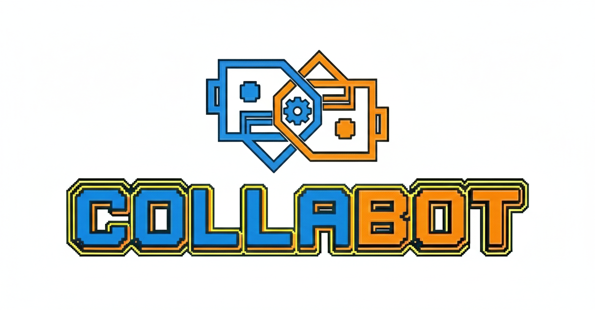

<p align="center">
  <picture>
    <source media="(prefers-color-scheme: dark)" srcset="branding/logo-full-dark.png">
    <source media="(prefers-color-scheme: light)" srcset="branding/logo-full-light.png">
    
  </picture>
</p>

<p align="center">
  <strong>The Collaborative Agent Platform</strong><br>
  Dispatch, coordinate, and manage AI bots across your projects.
</p>

<p align="center">
  <a href="https://npmjs.com/package/collabot"></a>
  <a href="https://github.com/MrBildo/collabot/actions/workflows/ci.yml"></a>
  <a href="LICENSE"></a>
</p>

---

Collabot is home base for your AI bots. It runs as a persistent service, dispatching bots to work on tasks across multiple projects. You define the projects, roles, and bots. Collabot handles the rest — dispatch, coordination, event capture, context reconstruction, and communication.

A **project** is a logical product that may span multiple repositories. Collabot provides the infrastructure; projects bring the domain knowledge.

## How it works

The **harness** is the core — a persistent Node.js/TypeScript process that manages everything. Interfaces connect to it through adapters. No adapter is primary. The harness runs with or without any of them.

```
                  +------------+
       Slack ---->|            |
        CLI ----->|  Harness   |-----------> Bots
  WebSocket ----->|            |               |
        TUI ----->|            |         +-----------+
                  +------------+         |  Project  |
                                         |   repos   |
                                         +-----------+
```

**Adapters** connect humans to the harness — DM a Slack bot, type in a TUI, send a WebSocket message, or fire a CLI one-liner. The harness resolves the right project, role, and bot, then dispatches.

**Roles** define behavioral profiles — identity, model preference, and permissions. They're tech-stack-focused, not project-specific. A `.NET developer` role works on any .NET project.

**Bots** are persistent identities that sit above roles. A bot has personality, a default project, a role assignment, and (eventually) memories. Think of roles as the job description and bots as the person filling it.

## Current state

Collabot is pre-release (`0.x`) and under active development. What's working today:

- **Multi-project orchestration** — register projects, dispatch bots with role-based context
- **4 adapters** — Slack (multi-bot, per-bot Socket Mode), CLI, WebSocket (JSON-RPC 2.0), TUI (.NET 10)
- **Bot session pattern** — persistent bot identities with resume-per-message SDK sessions
- **Event system v2** — canonical event streams scoped to dispatches, full agent lifecycle capture
- **Multi-bot coordination** — PM bots dispatch teammates via MCP tools, await results, synthesize
- **Task lifecycle** — create, dispatch, capture, close — all scoped to projects
- **Parallel dispatch** — git worktree isolation for concurrent bots on the same repo
- **333+ tests**, TypeScript strict mode, CI on every PR

## Quick start

```
npm install -g collabot
collabot init          # scaffold ~/.collabot/
collabot start         # start the harness
```

See the [package README](https://npmjs.com/package/collabot) for configuration details.

## Vision

We're building a team, not a workflow tool. Collabot is where your bots live — they have roles, personalities, projects they care about, and (eventually) memories of past work. The platform ships infrastructure, not content. A fresh install is essentially empty — you build up the team that fits your projects.

Three principles drive the design:

- **Curated context over large context.** The right 10K tokens beats 100K tokens of vibes. Collabot assembles precise context, not maximum context.
- **Documentation is memory.** Bots have no memory between sessions. What's written down is what they know. Docs evolve in the same commit as code.
- **Iterative formalization.** Start loose, use the system, let the shape emerge, then codify. The loose version isn't debt — it's research.

## Documentation

| Document | Description |
|----------|-------------|
| [Architecture](docs/process/agent-orchestration-architecture.md) | Platform architecture |
| [Platform Vision](docs/vision/authoring-and-knowledge.md) | Authoring conventions, knowledge model, growth philosophy |

## License

[MIT](LICENSE)
